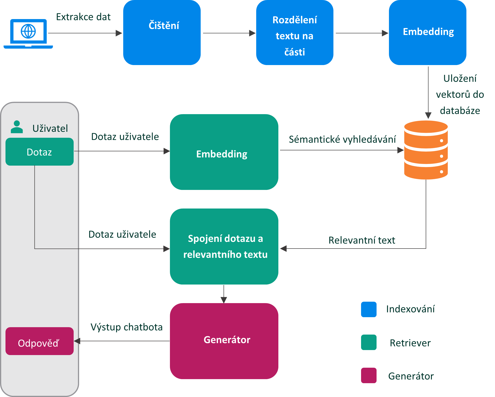

# Experiment 1: Základní RAG systém

Tento experiment představuje **základní verzi RAG (Retrieval-Augmented Generation) systému**, který kombinuje vyhledávání relevantních informací a jejich následné využití k generování odpovědí pomocí velkých jazykových modelů (LLM).
## 🧩 Architektura systému
Architektura se skládá ze tří hlavních komponent:

1. **Indexování**  
   - Získávání dat z webových stránek pomocí `BeautifulSoup` a `requests`
   - Čištění dat (odstranění HTML tagů, prázdných znaků, speciálních symbolů)
   - Rozdělení textu na části (`chunking`) s parametry `chunk_size` a `chunk_overlap`
   - Vytvoření vektorových reprezentací pomocí embedding modelu `text-embedding-ada-002`
   - Uložení embeddingů do vektorové databáze Pinecone

2. **Retriever**  
   - Uživatelský dotaz je převeden do vektorové podoby
   - Prohledává se databáze embeddingů pro nalezení nejrelevantnějších textových segmentů (`Top-k`)
   - Použité skórování na základě kosinové podobnosti

3. **Generátor**  
   - Získané textové segmenty a uživatelský dotaz jsou předány modelu `gpt-3.5-turbo`
   - Model vygeneruje odpověď, která je vrácena uživateli

Tato základní architektura slouží jako první krok k experimentům s optimalizací vyhledávání a generování odpovědí pomocí RAG modelů:

## 🗂️ Struktura kódu

- `indexing.py` – Tento skript slouží pro přípravu dat do vektorové databáze.  
  Provádí:
  - načtení a extrakci textového obsahu z webových stránek (pomocí knihovny `BeautifulSoup` a `requests`),
  - čištění textu od HTML tagů a nadbytečných znaků (`strip()`, `replace()`, regulární výrazy),
  - rozdělení textu na části (chunking),
  - výpočet embeddingů pomocí modelu `text-embedding-ada-002`,
  - uložení výsledných vektorů do databáze Pinecone.

- `main1.py` – Hlavní skript pro běh chatbotu v rámci experimentu 1.  
  Obsahuje rozhraní ve Streamlit, logiku retrieveru a generování odpovědí pomocí OpenAI API.  
  Tento skript je určen pro testování základní RAG architektury popsané výše.

- `evaluation1.py` – Pomocný skript pro vyhodnocení výsledků.  
  Po spuštění analyzuje odpovědi generované chatbotem a vypočítá klíčové metriky, jako jsou:
  - celková spotřeba tokenů,
  - délka odpovědí,
  - průměrné skóre podobnosti s použitým kontextem.
 
## 📁 Výstupy

- Výstupy experimentu (odpovědi) jsou ukládány do souboru `outputs1.txt`

📊 Vizualizace výsledků je zobrazena v tabulce níže.  

## ⚙️ Parametry testovaných verzí

V rámci testování bylo provedeno 6 variant experimentu (1a–1f), které se liší velikostí segmentů a mírou překryvu:

| Verze | Chunk size | Overlap | Top-k | Přesnost (ACC %) | Tokeny |
|-------|------------|---------|-------|------------------|--------|
| 1a    | 256        | 10      | 10    | 50               | 69 481 |
| 1b    | 370        | 20      | 7     | 52               | 67 113 |
| 1c    | 512        | 40      | 5     | 50               | 63 216 |
| 1d    | 640        | 60      | 4     | 48               | 60 763 |
| 1e    | 768        | 80      | 3     | 43               | 52 264 |
| 1f    | 1024       | 100     | 2     | 45               | 46 489 |

🧠 Výsledek ukázal, že **menší textové segmenty** s vyšším počtem vrácených výsledků (**Top-k**) vedou k **vyšší přesnosti**, zatímco **delší segmenty** snižují **spotřebu tokenů**, ale zároveň i **kvalitu odpovědí**.

📌 Tento experiment pomohl lépe se zorientovat v tom, **jaká délka textových segmentů je nejvhodnější** pro další testování – tedy **kde leží rovnováha mezi přesností a efektivitou** systému.

## 🔍 Shrnutí problému v experimentu 1

Experiment pracuje s reálnými dotazy z příloh A, B a C diplomové práce. Hodnocení odpovědí bylo provedeno manuálně s ohledem na očekávané odpovědi.

- V některých případech byly odpovědi nepřesné, protože generátor nedostal všechny důležité informace – ty byly rozptýlené v několika segmentech, nebo nebyly správně vybrány retrieverem.

- **Studenti často používají běžný hovorový jazyk** (např. *„jak se dostanu na magistra“*), zatímco **webové stránky používají formální formulace** (např. *„podmínky pro přijetí do navazujícího magisterského studia“*).  
  **Retriever v základní verzi nebyl dostatečně robustní**, aby tyto **strukturální nebo sémantické rozdíly** rozpoznal, což vedlo ke **ztrátě relevance** při výběru textů.
-  Při dělení textu na úseky často vznikaly velmi krátké "zbytky" na konci dokumentů, které neobsahovaly žádné důležité informace.  
  Embedding model jim přesto přiřadil vektory, které byly **nesprávně hodnoceny jako velmi podobné uživatelskému dotazu**, protože chyběla sémantická výpověď. 🤷‍♂️  Retriever následně vybíral tyto prázdné nebo nerelevantní texty, protože je považoval za důležité. Pokud se v databázi nenacházel relevantní kontext, systém i přesto zpracoval tyto nerelevantní úseky – a zbytečně tak spotřeboval tokeny při generování odpovědi.

